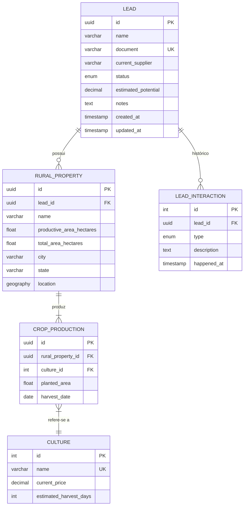

```mermaid
erDiagram
    LEAD ||--o{ RURAL_PROPERTY : "possui"
    LEAD ||--o{ LEAD_INTERACTION : "histórico"
    RURAL_PROPERTY ||--|{ CROP_PRODUCTION : "produz"
    CROP_PRODUCTION }|--|| CULTURE : "refere-se a"

    LEAD {
        uuid id PK
        varchar name
        varchar document UK
        varchar current_supplier
        enum status
        decimal estimated_potential
        text notes
        timestamp created_at
        timestamp updated_at
    }

    RURAL_PROPERTY {
        uuid id PK
        uuid lead_id FK
        varchar name
        float productive_area_hectares
        float total_area_hectares
        varchar city
        varchar state
        geography location
    }

    CROP_PRODUCTION {
        uuid id PK
        uuid rural_property_id FK
        int culture_id FK
        float planted_area
        date harvest_date
    }

    CULTURE {
        int id PK
        varchar name UK
        decimal current_price
        int estimated_harvest_days
    }

    LEAD_INTERACTION {
        int id PK
        uuid lead_id FK
        enum type
        text description
        timestamp happened_at
    }
```
